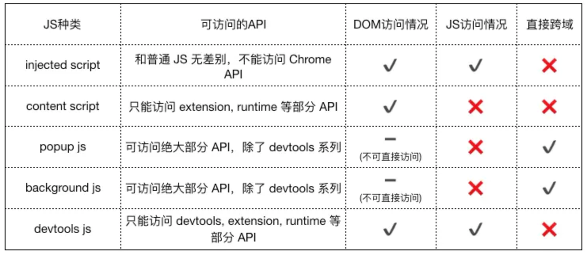

# 入门系列1 - Chrome Extensions的核心文件

## 核心文件
### ⭐️⭐️⭐️manifest.json
配置文件，必选。用于告诉 Chrome 有关该扩展工具相关重要信息，类似于 package.json 文件。

```
{
    "manifest_version": 2,  // 写死，不允许修改
    "name": "",             // 扩展工具名称
    "version": "",          // 扩展工具版本号
    "description": "",      // 扩展工具主要描述
    "author": ""            // 扩展工具作者
}
```

### ⭐️⭐️⭐️popup
可选。即浏览器右上角上点击扩展工具 icon 出现的下拉页面。

如下 manifest 配置项

```
{
    "browser_action": {
        "default_icon": "favicon.ico",
        "default_popup": "popup.html"
    }
}
```

### ⭐️⭐️⭐️content script
可选。即将该脚本注入到网页中，同时克对当前访问页面进行读写操作（读取和修改当前页面DOM）。

如下 manifest 配置项

```
{
    "content_scripts": [ // ⚠️注意：数组类型
        {
            "matches": ["*://*/*"], // 匹配的页面
            "js": ["content.js"]    // 注入的脚本
        }
    ]
}
```

### ⭐️⭐️⭐️background
可选。用于存储数据，运行在浏览器中的后台脚本，并将分析注册的脚本来查找它需要监听的事件等，与当前浏览器页面无关。是所有文件中生命周期最长的类型。persistent属性表明脚本的持久性。

如下 manifest 配置项

```
{
    "background": {
        // page 或 js方式。如果指定 js，那么会自动生成一个背景页
        "page": "background.html"
        // "js": ["background.js"]
    }
}
```

特别说明：虽然可以通过 chrome-extension://xxx/background.html 直接打开后台页，但是打开的后台页和真正一直在后台运行的那个页面不是同一个。

#### event-pages
可选。鉴于 background 生命周期太长，长时间挂载后台可能会影响性能。所以通过给 background 配置 persistent: false 属性来生成 event-pages。
它的生命周期是：在被需要时加载，在空闲时被关闭，什么叫被需要时呢？比如第一次安装、插件更新、*有content-script向它发送消息*，等等。

如下 manifest 配置项

```
{
    "background": {
        "scripts": ["eventPage.js"],
        "persistent": false
    }
}
```

### injected-script
可选。指的是通过 DOM 操作的方式向页面注入的一种 js。它出现的原因是：content-script 无法访问页面中的 js，它可以操作 DOM，但 DOM 不可以调用它。即在 DOM 中无法通过绑定事件方式调用 content-script 中代码。
使用场景如：在页面上添加一个按钮并调用插件的扩展API

如下 manifest 配置项

```
{
    // 普通页面能够直接访问的插件资源列表，如果不设置是无法直接访问的
    "web_accessible_resources": [
        "inject.js"
    ]
}
```

## 脚本权限
脚本的类型决定着脚本存在什么权限，比如 Chrome API, DOM 访问, 跨域访问, 原页面 js 访问。具体如下图：

