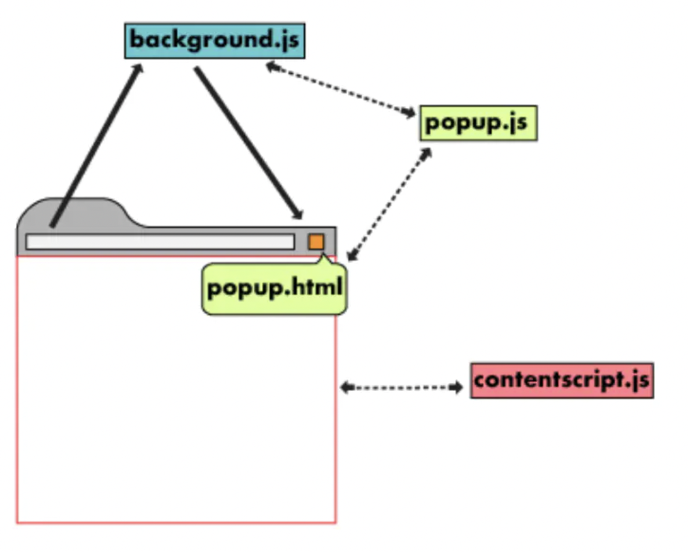
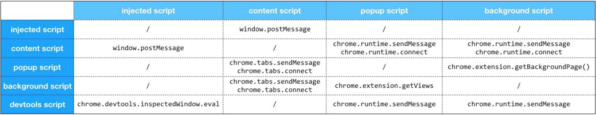

# 入门系列2 - Chrome Extensions页面间通信机制

扩展工具中 background, popup, content 三大核心页面间关系图如下：



由于通信是双向的，background, popup, content 三大通信渠道拥有6种通信方式。

* background 给 popup 发送消息
* popup 给 background 发送消息
* popup 给 content 发送消息
* content 给 popup 发送消息
* content 给 background 发送消息
* background 给 content 发送消息

## ⭐️⭐️⭐️如何监听数据？
监听消息的方式三者都一样。

```
chrome.extension.onMessage.addListener(function (request, sender, sendResponse) {
    sendResponse('接收到了');
});
```

## ⭐️⭐️⭐️如何发送数据？
分两种方式。

#### 一种：给 background 或 popup 发送数据

```
chrome.extension.sendMessage({
    message: 'content 向其他发送数据'
}, function (response) {
    console.log(response);
});
```

⚠️注意：给 background 或 popup 发送数据时会同时给 background 或 popup （如果有打开的话） 发送数据。所以建议在传输数据时，标记下发给谁。


#### 另一种：给content（前端）发送数据。由于前端可能存在多个 tab，需要指定给那个 tab 发送。

```
chrome.tabs.query({
    active: true, // 激活的tab
    currentWindow: true
}, function (tabs) {
    // 例如（tabs[0].id）：给第一个 tab 发送数据
    chrome.tabs.sendMessage(tabs[0].id, {
        message: '给 content 发送的数据'
    }, function (response) {
        console.log(response);
    });
});
```

## 其他知识点
### popup 可直接调用 background 方法 (background 给 popup 发送消息)

```
// 先获取 background 页面
var bg = chrome.extension.getBackgroundPage();
// 再在返回的对象上调用 background.js 里的方法
bg.startBrowserAction();
```

另外注意：点击图标出现和隐藏 popup 弹窗页面，实际上是对整个页面的销毁，类似于关闭网页，而不是切换网页。

### 长连接和短连接
* 长连接：chrome.*.connect
* 短连接：chrome.*.sendMessage

### 大致通信图

