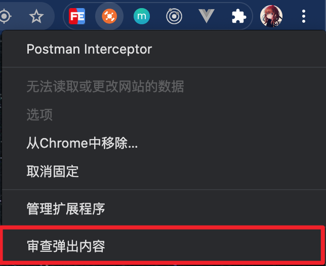
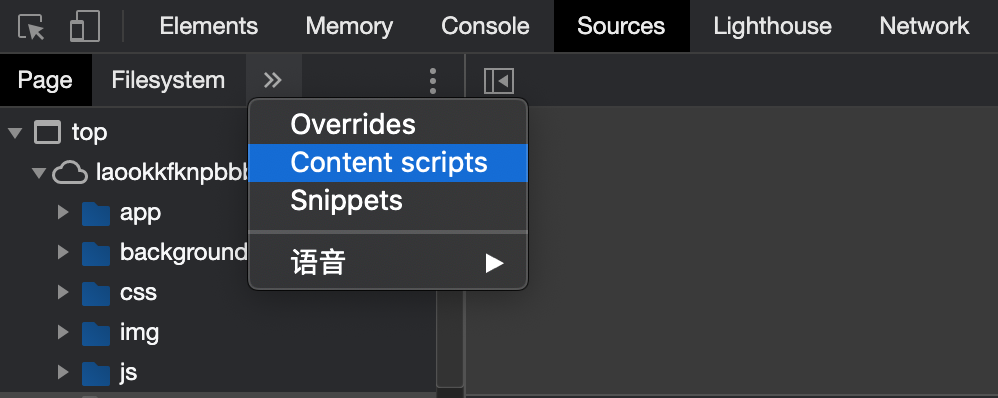
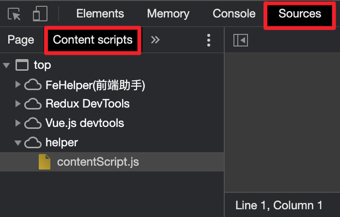
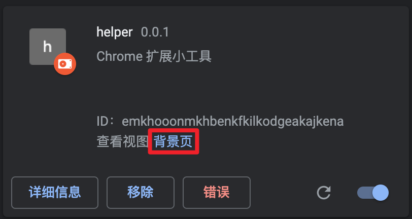

# 入门系列3 - Chrome Extension的调试

## 调试 popup
浏览器右上角扩展工具icon右击 -> 菜单 -> 审查弹出内容

## 调试 content
浏览器右击 -> 菜单 -> 检查 -> source -> Content scripts

## 调试 background
扩展程序页面：chrome://extensions/

## 其他
若扩展工具出现错误，信息也在扩展程序页面中也可能出现「错误」按钮，如上[调试 background]图。